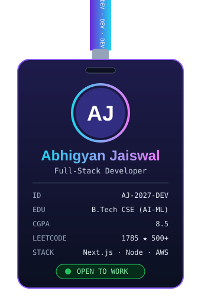

  <picture>
    <source media="(prefers-color-scheme: light)" srcset="./banner-light.svg">
    
  </picture>

<table>
<tr>
<td width="340" align="center" valign="top">

</td>
<td valign="top">

### 🚀 Featured Projects

| 🛠️ Project | 💻 Tech | 🔗 Links |
| :-- | :-- | :-- |
| **🎤 Liftoff Interviews** — AI mock-interview platform with real-time feedback & Whisper transcription | `Next.js` `OpenAI` `Redis` `FFmpeg` | [Code](https://github.com/AbhigyanJaiswal/liftoff) · [Live](https://liftoff-1et5e4lui-abhigyan-jaiswals-projects-3132429f.vercel.app/) |
| **🛒 QuickCart** — Full-stack e-commerce, SSR, Stripe checkout, 35% faster FCP | `Next.js 14` `Stripe` `MongoDB` `Redux` | [Code](https://github.com/AbhigyanJaiswal/QuickCart) · [Live](https://quick-cart-six-umber.vercel.app/) |

### 💼 Experience

| 🏢 Company | 🎯 Role | 📅 When |
| :-- | :-- | :-- |
| **Omnicare Diagnostics** (London, UK · Remote) | Software Developer | May 2026 – Present |
| **Kartzia Pvt. Ltd.** (Remote) | Backend Developer Intern | Jan – Mar 2026 |
| **TechieHelp** (Remote) | Frontend Developer Intern | Sep – Oct 2025 |

> 💜 *"Ship fast, optimize later, solve problems daily."*

</td>
</tr>
</table>

### 🧰 Tech Stack

   
  

### 📊 GitHub Stats & Graphs

  
  

  

  

  

### 🧩 LeetCode

  

- 🏆 Contest rating **1785** · Global Rank **165** / 41,000+ in Biweekly Contest 175
- ✅ **500+** problems solved · Top 1500 Google THE BIG CODE 2026 · AIR 264 & 459 CODEQUEST
- 👨‍🏫 Mentored **200+ students** as Competitive Programming Lead, Binary Brains Society

### 🐍 Watch the snake eat my contributions

  <picture>
    <source media="(prefers-color-scheme: dark)" srcset="https://raw.githubusercontent.com/AbhigyanJaiswal/AbhigyanJaiswal/output/github-snake-dark.svg">
    
  </picture>

### 📫 Let's Connect

  
  
  
  
  

  

<i>⭐️ Always learning, always building.</i> 💜

